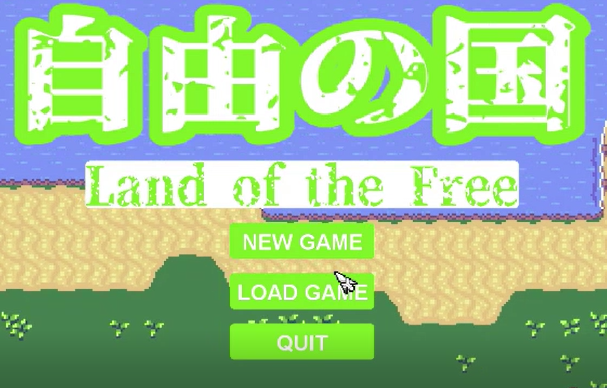
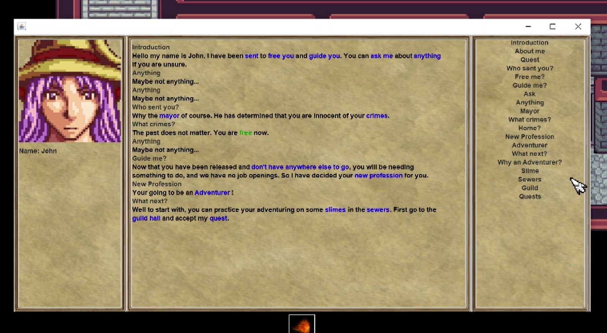
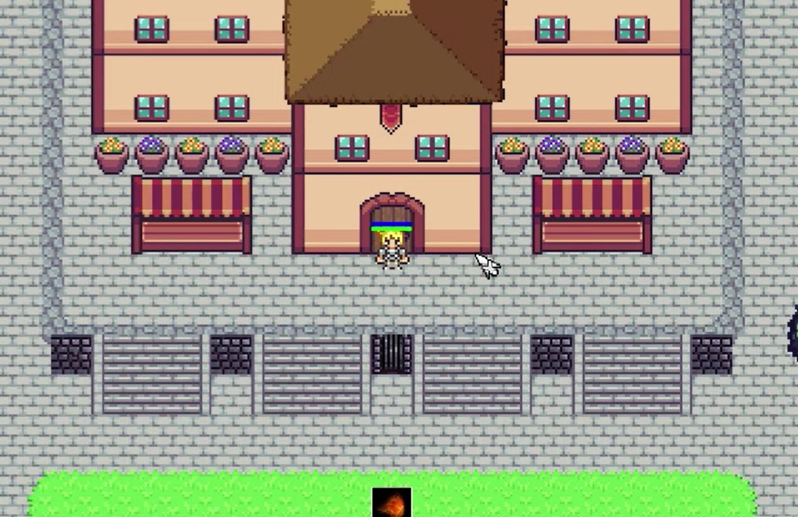
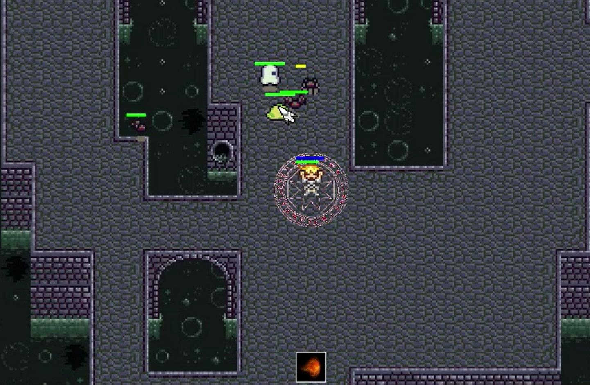

<h1>Land of the Free (Game Dev Assignment)</h2>

  

  

  

  

<h2>Overview</h2>
This project involved creating a solo game from scratch, using the java swing framework and took about a month to complete.
  
 
<h2>Mechanics</h2>
<li>Movement – Player and entity movement has been vastly changed, with directional sprites that are swapped out depending on which way the player is facing. The movement is also calculated as a vector and applied later so that if opposite directions are pressed, they will cancel out. Footstep sounds are played as well depending on where the entity is. The movement system also ties into the collision system and is applied one axis at a time to allow entities to slide off blocks instead of getting stuck on them.
<li>Attacking – The player and entities can attack with their fists which checks if a fist collides with another entity at the climax, dealing damage and starting the combat system. Punch sounds are played too.
<li>Casting – One of the main mechanics of the game is casting, which allows the player to design their own spells from given elements and aiming patterns and deciding the damage and size of their spell. These spells can have different animation variants and will cast the corresponding projectiles at the entities aim. They have a sound effect as well.
<li>Questing – The player can accept randomly generated quests in the guild building from any NPC to kill a certain amount and type of enemy, and even rare assassination quests, and once completed the quest can be turned in by talking to the NPC to receive money.
<li>Dialogue – The player can talk to any NPC about any topic which the player and NPC have in common. This topic can contain further topics that the player can then ask the NPC if they have knowledge of it. Dialogue can even trigger story moments like a boss fight or progress the main quest.
<li>Saving and Loading – The game supports both manual saving and loading as well as quick saving and loading for when you want to try something out in a non-permanent way. This is done using serialization, and I had to do a lot of manually serializing objects.
<li>Controller Button Changing – The player can change the buttons and keys for any of the in-game actions to whatever they want, with exceptions for moving and aiming must be WASD, arrows, mouse, left stick or right stick.
<li>Volume Controllers – The player can change the master volume, music volume and sound volume.
<li>Levelling Up – Using the money from quests, the player can talk to the statue of the Lady of the Light to level up their stats as well as get a full heal.
<li>Death – Upon the player dying, they can choose to start a new game or load a previous save.

 
 
<h2>Features</h2>
<li>World – The game features a <i>large</i>, handcrafted world that player can explore.
<li>Dungeons – The game has 2 procedurally generated dungeons with floor appropriate enemies with increasing difficulty per floor (YOU WILL GET LOST).
<li>NPCs – The game has almost 40 NPCs with a few custom lines of dialogue each. Each NPC also has their own skin and animations and will become hostile if you attack them.
<li>Music – The game has more than 10 songs in it, ranging from battle themes to peaceful overworld, these songs will also swap around in their groups, so you won’t always get Overworld A but B and C as well.
<li>Sounds – The game has sound effects in it, ranging from casting to attacking, from footsteps to death cries, from grunts when hit to door sounds. These sounds are triggered in the model and can overlap as each one is created on a new thread which is recycled when it is done.
<li>Rooms – Every house and building in the game has handmade rooms to walk around in.
<li>Collision system – The game has a rectangle collision system that works with walls, entities and projectiles. These collisions have also been customised allowing for collisions such as talking to NPCs, not letting the player pass in a certain point of the game, teleports, tiles like water that projectiles can fly over but entities cannot and teleports that only sometimes allow the player to teleport.
<li>Story – The game has a complete story, from john letting you out of prison, to giving you your first quest, asking you to do more quests, and finally becoming the final boss which, you must defeat.
<li>Combat System – The game has a engaging combat system which adds entities to the players combat list and removing them if dead or not hostile. The music also switches to combat music, which has led to a few jump scares for me in the dungeons.
<li>UI – The game features many menus which allow the player to interact with the game on a different level, such as spells, quests, saving, levelling up, switching buttons, and changing volume.

 
 

<h2>Functional Game</h2>
<li>Ending – The game has an ending as aforementioned, however the game allows for post-game gameplay.
<li>Beginning – The game has a start, and the camera nicely moves progressively to where the cells are to give a cutscene type start to the game. John will also explain to the player that they must go get a quest at the guild hall, and how to carry it out.
<li>Death – When the player dies the main menu will appear again over the dead player allowing for them to start again, reload a save or quit, thus preserving the gameplay loop.
<li>Saving and Loading – The game allows saving and loading which helps the game be practical as players can save the state of their game and return to it later.
<li>Performance – The game has taken a performance hit since I added all of the NPCs but it is still playable, the pre NPC version runs very stable as shown in the video.
<li>Combat – The combat is quite fun especially against mage type enemies as it turns into a dance where you have to stop to attack, but doing so means the enemy can counter-attack, thus leading to interesting on the go strategizing. Adding in multiple enemies, only extends this.

 
 

<h2>Multiple Controllers</h2>
<li>Controller – The game supports controllers, to the best that I could test. The only controller I had available to test with was a switch pro controller, but with that the game works perfectly well.
<li>Keyboard and Mouse – The game works with keyboard and mouse.
<li>Button switching – The game allows the player to decide which buttons will correspond to which game action. This includes menu buttons, motion buttons, aiming buttons and attack/cast buttons. This way the player can use any control pattern they want.
<li>AI – The AI also is a controller, which if hostile decides to run towards the player and attack if it is in range. If non hostile the entity will wander around aimlessly.

 
 

<h2>Retrospective</h2>
Over the course of this project, I have learnt a vast amount of game development and computer science skills and gained experience over almost 10,000 lines of code. Doing things such as, animating sprites, creating tile maps, parsing xml files, creating xml files for custom data, procedurally generating things, tons of UI work (Still painful), playing audio in java, connecting a controller to java, learning about more advanced java concepts like transience, multi-threading, synchronization and serialisation. 
  
I think I set my goals a little too high as a 2nd year, and so my game has a quantity over quality outcome, where there are still bugs even in the final version such as songs not playing correctly or menu glitches, but in general it works, and reloading a save usually fixes anything game breaking, and from my experience as a gamer, that’s about the best you can hope for when doing large scale games as a solo dev.

 
 
<h2>Video Demo</h2>
 
<video controls>
    <source src="gameplay.mp4" type="video/mp4">
  </video>